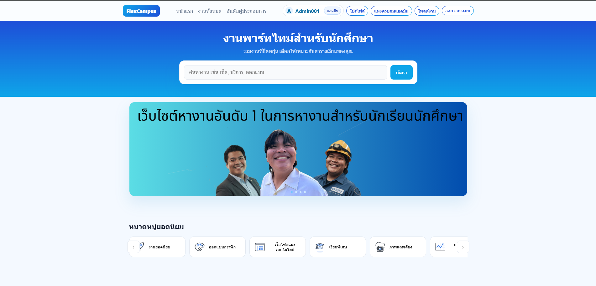

# FlexCampus



โปรเจกต์เว็บไซต์สแตติกสำหรับโพสต์งานพาร์ทไทม์

## คุณสมบัติหลัก
- ค้นหาและดูงานพาร์ทไทม์แบบสแตติกจากหน้า `index.html`
- หน้ารวมงานและรายละเอียดงาน: `html/jobs.html`, `html/job-detail.html`
- ระบบสมัครสมาชิก/เข้าสู่ระบบ: `html/register.html`, `html/login.html`
- หน้าโปรไฟล์และติดตามใบสมัคร: `html/profile.html`, `html/check-application.html`
- ฝั่งผู้ประกอบการ: ยื่นขอเป็นผู้ประกอบการ, โพสต์งาน, จัดการงาน: `html/employer-apply.html`, `html/post-job.html`, `html/employer-dashboard.html`
- อันดับผู้ประกอบการยอดนิยม: `html/ranking.html`
- ฝั่งแอดมินสำหรับดูสถิติและจัดการงาน: `html/admin.html`

## โครงสร้างโปรเจกต์
- `index.html` หน้าแรกของเว็บไซต์
- `html/` หน้าเพจต่าง ๆ ของระบบ
- `css/` สไตล์หลักและสไตล์เฉพาะหน้า
- `js/` สคริปต์สำหรับแต่ละหน้า
- `images/` รูปภาพและไอคอนที่ใช้ในเว็บ
- `server/` โค้ดแบ็กเอนด์ Node.js (Express + JWT + Mongoose)
- `logs/` ไฟล์ล็อกฝั่งเว็บ/เซิร์ฟเวอร์

## การใช้งานแบบสแตติก (ไม่มีแบ็กเอนด์)
- เปิดไฟล์ `index.html` ด้วยเบราว์เซอร์ได้ทันที
- เหมาะสำหรับดีพลอยบน GitHub Pages / Cloudflare Pages / Netlify / Vercel

## การรันเซิร์ฟเวอร์ (ตัวเลือก)
เซิร์ฟเวอร์ให้ API สำหรับสมัคร/ล็อกอิน, โพสต์งาน, สมัครงาน, อนุมัติใบสมัคร ฯลฯ

1) ติดตั้งและรันในโฟลเดอร์ `server/`
```bash
cd server
npm install
npm start
```
- ถ้าไม่ตั้ง `MONGO_URI` ระบบจะทำงานโหมดหน่วยความจำ (in-memory) ทดสอบได้ทันที
- เมื่อมีฐานข้อมูล MongoDB ระบบจะบันทึกข้อมูลจริงผ่าน Mongoose

## ตัวอย่างไฟล์ .env (ใน `server/.env`)
```env
PORT=5174
HOST=0.0.0.0
WEB_PATH=..
MONGO_URI=mongodb://localhost:27017
MONGO_DB=University
JWT_SECRET=changeme
ADMIN_EMAIL=admin@example.com
ADMIN_USERNAME=admin
ADMIN_PASSWORD=changeme
```

## API หลัก (สรุป)
- การยืนยันตัวตน
  - `POST /api/auth/register`
  - `POST /api/auth/login`
  - `GET /api/auth/me`
- งานและการสมัครงาน
  - `GET /api/jobs`, `GET /api/jobs/:id`
  - `POST /api/jobs/:id/apply` สมัครงาน
  - `POST /api/jobs/:id/like` กดถูกใจ/ยกเลิกถูกใจ
  - `GET /api/jobs/top-liked` งานยอดนิยม
- ผู้ประกอบการ
  - `POST /api/employer/apply`, `GET /api/employer/application/status`
  - `POST /api/employer/jobs` สร้างงาน
  - `PUT /api/employer/jobs/:id`, `DELETE /api/employer/jobs/:id`
  - `GET /api/employer/jobs/my`
  - `GET /api/employer/jobs/:id/applications`
  - `POST /api/employer/jobs/:jobId/applications/:appId/approve|reject|message`
- ผู้ใช้
  - `GET /api/user/profile`, `PUT /api/user/profile`
  - `GET /api/user/applications`
- แอดมิน
  - `GET /api/admin/stats`
  - `GET /api/admin/employer-applications`
  - `POST /api/admin/employer-applications/:id/approve|reject`
  - `GET /api/admin/jobs`, `DELETE /api/admin/jobs/:id`
- ดีบัก/สุขภาพระบบ
  - `GET /health`, `GET /api/debug/users-count`, `GET /api/debug/users`

## ดีพลอยฟรีอย่างรวดเร็ว
- GitHub Pages: เปิด `Settings → Pages` แล้วตั้ง Source เป็นสาขา `main` โฟลเดอร์ `root`
- Cloudflare Pages: `Developer Platform → Pages → Create a project → Upload assets` เลือกโฟลเดอร์โปรเจกต์
- Netlify/Vercel: สร้างไซต์ใหม่แล้วเลือกดีพลอยแบบสแตติก (Output directory เป็น `.`)

## ใบอนุญาต
- โปรเจกต์เพื่อการศึกษา/ตัวอย่าง คุณสามารถปรับใช้ตามต้องการ
